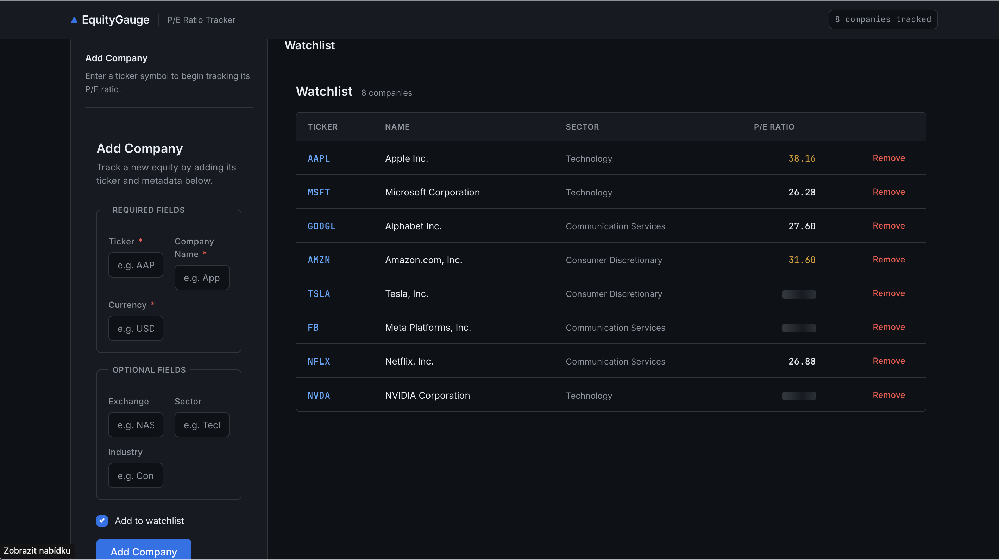

# EquityGauge


A financial web app for tracking and comparing stock P/E ratios. Portfolio project focused on FastAPI, React, web scraping, testing, and CI/CD.

## Table of Contents

- [About](#about)
- [Features](#features)
- [Tech Stack](#tech-stack)
- [Project Structure](#project-structure)
- [Getting Started](#getting-started)
  - [Docker (recommended)](#docker-recommended)
  - [Local Development](#local-development)
- [AI Code Generation Agent](#ai-code-generation-agent)
- [API Reference](#api-reference)
- [Testing](#testing)
- [CI/CD](#cicd)
- [License](#license)

---

## About

EquityGauge lets you quickly retrieve and compare Trailing P/E ratios for a watchlist of companies. The backend scrapes Yahoo Finance using Selenium, persists the ticker list in a YAML file, and exposes a REST API. The React frontend displays the watchlist with support for adding and removing tickers.



---

## Features

- Trailing P/E scraping from Yahoo Finance (Selenium + BeautifulSoup)
- REST API for watchlist management (GET, POST, DELETE)
- React frontend with a dashboard, watchlist table, and add-company form
- Data persistence via `tickers.yaml`
- Docker support for both backend and frontend
- CI pipeline: pytest → Postman (Newman) → Docker build
- AI agent that generates React components from natural-language descriptions via the Claude API

---

## Tech Stack

| Layer | Stack |
|---|---|
| Backend | Python 3.11, FastAPI, Selenium, BeautifulSoup4, PyYAML, Pydantic |
| Frontend | React 19, React Router, Vite |
| AI Agent | Node.js, Anthropic SDK (Claude Sonnet), prompt caching |
| Testing | Pytest, Newman (Postman) |
| CI/CD | GitHub Actions |
| Containerization | Docker, Docker Compose |

---

## Project Structure

```
EquityGauge/
├── backend/
│   ├── main.py            # FastAPI app and endpoints
│   ├── scraper.py         # Selenium driver + BeautifulSoup scraper
│   ├── data_manager.py    # tickers.yaml read/write
│   ├── tickers.yaml       # Watchlist data (persisted)
│   ├── requirements.txt
│   └── Dockerfile
├── frontend/
│   ├── src/
│   │   ├── components/
│   │   │   ├── Dashboard.jsx
│   │   │   ├── LandingPage.jsx
│   │   │   ├── WatchlistTable.jsx
│   │   │   └── AddCompanyForm.jsx
│   │   ├── App.jsx
│   │   └── main.jsx
│   ├── package.json
│   └── Dockerfile
├── tests/
│   ├── test_scraper.py
│   ├── test_data_manager.py
│   └── Main_API_Tests.postman_collection.json
├── agents/
│   └── frontend-agent/    # AI agent for React component generation
│       ├── tools/         # generate, parse, validate, write
│       ├── prompt/        # system prompt, design guide, few-shot examples
│       ├── templates/     # react-component, dashboard, landing-page
│       ├── output/        # generated files land here
│       ├── config.json
│       └── run.js
├── .github/workflows/
│   └── ci.yml
└── docker-compose.yml
```

---

## Getting Started

### Docker (recommended)

```bash
docker compose up --build
```

- Backend: `http://localhost:8000`
- Frontend: `http://localhost:5173`

### Local Development

**Backend:**

```bash
python -m venv venv
source venv/bin/activate  # Windows: venv\Scripts\activate
pip install -r backend/requirements.txt
fastapi dev backend/main.py
```

API available at `http://localhost:8000`. Swagger UI at `http://localhost:8000/docs`.

> The backend requires Chrome/Chromium and ChromeDriver for Selenium scraping.

**Frontend:**

```bash
cd frontend
npm install
npm run dev
```

Frontend available at `http://localhost:5173`.

---

## AI Code Generation Agent

`agents/frontend-agent` is a Node.js agent that generates production-ready React components from natural-language descriptions by calling the Claude API.

**How it works:**

1. A natural-language prompt describes the desired UI element or page.
2. The agent sends it to Claude Sonnet with a curated system prompt (API schema, design rules, few-shot examples) and **prompt caching** to reduce latency and cost on repeated runs.
3. The raw response is parsed into separate JSX and CSS blocks, validated, and written to `output/`.
4. A final step copies the generated files directly into `frontend/src/components/`.

**Run the agent:**

```bash
cd agents/frontend-agent
npm install
node run.js
```

**Example — generating the watchlist table:**

```js
await generate(
  "Watchlist table showing all companies from GET /companies. " +
  "For each ticker fetch P/E from GET /companies/{ticker}/pe. " +
  "Columns: ticker, name, sector, P/E (color-coded: <15 green, 15–30 neutral, >30 red). " +
  "Each row has a delete button. Show skeleton loading and error banner.",
  "react-component"
);
```

The agent generated all four frontend components in this project (`WatchlistTable`, `AddCompanyForm`, `Dashboard`, `LandingPage`).

| Template type | When to use |
|---|---|
| `react-component` | Reusable UI piece (table, card, form) |
| `dashboard` | Data-heavy page with multiple panels |
| `landing-page` | Full standalone marketing page |

---

## API Reference

| Method | Endpoint | Description |
|---|---|---|
| `GET` | `/` | Health check |
| `GET` | `/companies` | Returns all tickers in the watchlist |
| `POST` | `/companies` | Adds a new ticker to the watchlist |
| `DELETE` | `/companies/{ticker}` | Removes a ticker from the watchlist |
| `GET` | `/companies/{ticker}/pe` | Scrapes and returns the Trailing P/E ratio |

**POST `/companies` — request body:**

```json
{
  "ticker": "AAPL",
  "name": "Apple Inc.",
  "currency": "USD",
  "exchange": "NASDAQ",
  "sector": "Technology",
  "industry": "Consumer Electronics",
  "watchlist": true
}
```

---

## Testing

**Pytest (unit tests):**

```bash
pytest
```

**Postman / Newman (API integration):**

```bash
newman run tests/Main_API_Tests.postman_collection.json \
  --env-var "baseUrl=http://localhost:8000" \
  --env-var "ticker=AAPL" \
  --env-var "test_ticker=TEST"
```

---

## CI/CD

GitHub Actions pipeline (`.github/workflows/ci.yml`) triggers on every push and PR to `main`:

1. **test** — runs pytest
2. **postman** — starts the backend and runs API tests via Newman
3. **build** — builds the backend Docker image

The pipeline can also be triggered manually via `workflow_dispatch`.

---

## License

This project is licensed under the [MIT License](LICENSE).
